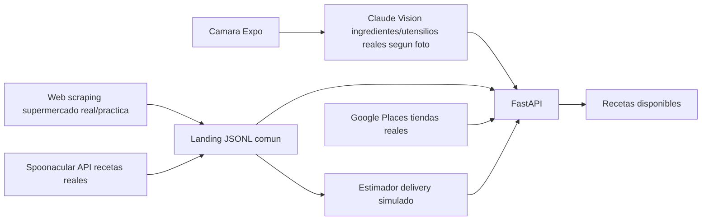

# Refri Inteligente

Proyecto academico de Ingenieria de Datos: recetas segun ingredientes y utensilios disponibles.

El sistema combina dos fuentes obligatorias de recopilacion de datos:

- Web scraping de productos de supermercado: nombre, precio y disponibilidad.
- API externa Spoonacular: recetas, cocina/pais, calificaciones y datos de ingredientes.

Tambien incluye vision por camara con Claude, tiendas cercanas con Google Places y un estimador educativo de delivery.

## Estructura

```text
backend/
  scraping/
  apis/
  vision/
  delivery/
  landing/
  tests/
  main.py
  pipeline.py
frontend/
  src/
  App.js
  package.json
ARQUITECTURA.md
```

## Backend

1. Crea y activa un entorno virtual:

```bash
cd backend
python -m venv .venv
.venv\Scripts\activate
```

2. Instala dependencias:

```bash
pip install -r requirements.txt
```

3. Copia variables de entorno:

```bash
copy .env.example .env
```

4. Edita `.env`:

```env
SPOONACULAR_API_KEY=tu_api_key
ANTHROPIC_API_KEY=tu_api_key
GOOGLE_PLACES_API_KEY=opcional
```

5. Ejecuta el pipeline:

```bash
python pipeline.py --ingredientes tomate,cebolla,pollo
```

6. Levanta la API:

```bash
uvicorn main:app --host 0.0.0.0 --port 8000 --reload
```

7. Pruebas:

```bash
pytest
```

## API keys

Spoonacular:

1. Crea cuenta en https://spoonacular.com/food-api
2. Entra al dashboard de desarrollador.
3. Copia tu API key en `SPOONACULAR_API_KEY`.
4. El plan gratuito suele tener limite bajo diario; el cliente respeta `Retry-After` y registra rate limits.

Anthropic:

1. Crea una API key en la consola de Anthropic.
2. Copiala en `ANTHROPIC_API_KEY`.
3. El endpoint `/analizar-cocina` degrada con mensaje claro si no existe la key.

Google Places:

1. Crea un proyecto en Google Cloud.
2. Habilita Places API.
3. Activa facturacion.
4. Copia la key en `GOOGLE_PLACES_API_KEY`.
5. Si no configuras esta key, `/donde-comprar` no truena: devuelve un mensaje pidiendo configurar la variable.

## Frontend Expo Go

1. Instala dependencias:

```bash
cd frontend
npm install
```

2. Configura la IP local de tu computadora:

```bash
copy .env.example .env
```

Edita:

```env
EXPO_PUBLIC_API_URL=http://TU_IP_LOCAL:8000
```

No uses `localhost` en un celular fisico con Expo Go, porque `localhost` apuntaria al telefono. Usa la IP local de la computadora donde corre FastAPI.

3. Ejecuta Expo:

```bash
npm start
```

4. Escanea el QR con Expo Go.

## Flujo de datos



Datos reales: scraping, Spoonacular, vision y Google Places cuando hay API key.

Dato simulado: costo de delivery, por razones legales y tecnicas documentadas en `ARQUITECTURA.md`.
